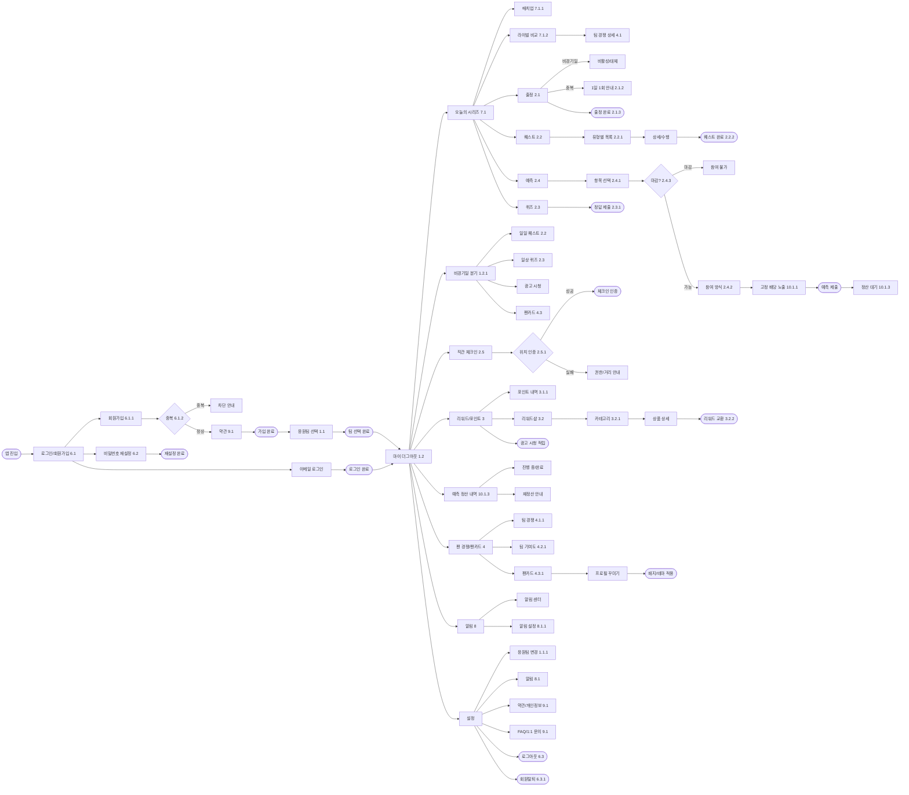
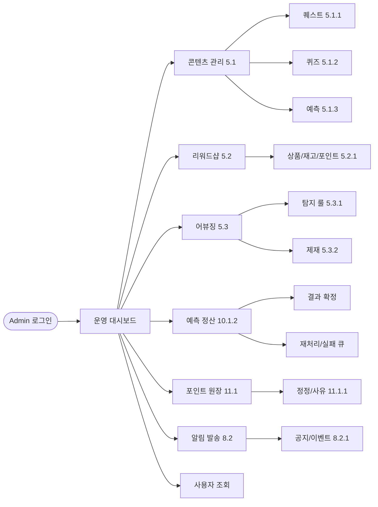

# 더그아웃(DUGOUT) — 정보구조(IA)

> 작성: 2026-04-30
> 입력 자료: `prd.md`, `제목 없는 스프레드시트 - 기능.pdf`, `더그아웃(DUGOUT) – 참여형 야구 팬 액션 플랫폼_2026-04-30.png`
> 표기: `[E.S.D]` = 기능명세 EPIC.상위.상세 번호. `■` = 종단 액션.

---

## 1. 갭 요약 (기존 IA → 보강)

| EPIC | 기능명세 항목 | 기존 IA | 보강 |
|------|--------------|---------|------|
| 1.1.1 | 응원팀 변경 | 없음 | 설정 하위 신설 |
| 1.2 | 홈 위젯(포인트·기여도·라이벌) | 일부 | 6개 위젯 명시 |
| 2.5 | 직관 체크인 예외 | 단일 노드 | 권한 거부/구장 외부 분기 |
| 3.1.1 | 포인트 잔액/내역 | 적립만 | 원장 조회 화면 신설 |
| 4.1 | 팀 경쟁 현황 | 누락 | 라이벌 비교 화면 신설 |
| 4.2 | 팀 기여도 | 없음 | 팬카드 탭 신설 |
| 7.1 | 오늘의 시리즈 | 진입만 | 매치업/라이벌 비교 분리 |
| 8 | 알림 | 1노드 | 인박스 + 설정 분리 |
| 9.1 | 약관/FAQ/문의 | 일부 | 4개 노드 분리 |
| 10.1.3 | 예측 정산 내역 | 없음 | 진행 중/완료/재정산 |
| 비경기일/오프시즌 | "경기 없는 날" | 빈 노드 | 일일 퀘스트/퀴즈/팬카드 + 스토브리그 콘텐츠 |
| EPIC 5/8.2/11.1 | Admin CMS | 없음 | Admin IA 신설 |

**예외/실패 상태 추가**: 가입 중복(6.1.2), 약관 미동의, 예측 마감/잔액 부족, 출정 1일 1회 중복(2.1.2), 비경기일, 어뷰징 제재 안내.

---

## 2. User IA (Markdown 트리)

```
앱 진입
├─ [6.1] 로그인/회원가입
│   ├─ [6.1.1] 회원가입 폼(최소 입력)
│   │   ├─ 이메일/휴대폰 검증 → [6.1.2] 중복 차단(예외)
│   │   ├─ [9.1] 약관 동의(필수/선택)
│   │   ├─ ■ 가입 완료
│   │   └─ [1.1] 응원팀 선택 (필수)
│   │       └─ ■ 팀 선택 완료
│   ├─ [6.1] 이메일 로그인 → ■ 로그인 완료
│   └─ [6.2] 비밀번호 재설정
│       └─ [6.2.1] 본인 인증 → 변경 → ■ 재설정 완료
│
└─ 마이 더그아웃 (홈) [1.2]
    ├─ 위젯 [1.2.1]: 오늘의 시리즈 / 출정 / 퀘스트·예측·퀴즈 / 포인트 잔액 / 팀 기여도 / 라이벌 비교
    │
    ├─ [7.1] 오늘의 시리즈 (경기일)
    │   ├─ [7.1.1] 매치업 요약
    │   ├─ [7.1.2] 라이벌 팬 비교 → [4.1] 팀 경쟁 상세
    │   ├─ [2.1] 출정하기
    │   │   ├─ [2.1.1] 비경기일 → 비활성/대체 CTA(예외)
    │   │   ├─ [2.1.2] 1일 1회 중복(예외 안내)
    │   │   └─ ■ [2.1.3] 출정 완료(포인트 지급/기록)
    │   ├─ [2.2] 퀘스트 진입 → 목록(일일/경기일/라이벌/시리즈/직관) [2.2.1]
    │   │   └─ 상세 → 수행 → ■ [2.2.2] 퀘스트 완료(보상 지급)
    │   ├─ [2.4] 예측 진입 → 항목 목록
    │   │   ├─ [2.4.1] 항목 선택(승리팀/키플레이어/장타)
    │   │   ├─ [2.4.2] 참여 방식(포인트/무료) → 잔액 부족(예외)
    │   │   ├─ [2.4.3] 마감 후 진입(예외 안내)
    │   │   ├─ [10.1.1] 고정 배당 노출
    │   │   └─ ■ 예측 제출 → [10.1.3] 정산 결과 대기
    │   └─ [2.3] 퀴즈 진입 → 풀이 → ■ [2.3.1] 정답 제출/판정
    │
    ├─ 비경기일/오프시즌 분기 [1.2.1]
    │   ├─ 일일 퀘스트 [2.2]
    │   ├─ 일상 퀴즈 [2.3]
    │   ├─ 광고 시청 [3]
    │   ├─ 팬카드 진입 [4.3]
    │   └─ 오프시즌 콘텐츠 (11~3월): FA 예측 / 트레이드 퀴즈 / 작년 회고 / KBO 어워드 예측
    │
    ├─ [2.5] 직관/체크인
    │   ├─ [2.5.1] 위치 인증 → ■ 체크인 인증
    │   └─ 위치 권한 거부 / 구장 외부(예외)
    │
    ├─ [3] 리워드/포인트
    │   ├─ [3.1.1] 포인트 잔액/내역(원장) 조회
    │   │   └─ ■ 포인트 적립/사용 이벤트 단위 기록
    │   ├─ [3.2] 리워드샵
    │   │   ├─ [3.2.1] 카테고리(기프티콘/야구용품/쿠폰/디지털)
    │   │   ├─ 상품 상세
    │   │   └─ ■ [3.2.2] 리워드 교환(포인트 차감/재고)
    │   └─ ■ 광고 시청 → 포인트 적립
    │
    ├─ [10.1.3] 예측 정산 내역  ⚠ 자유 환금 정책 (법무 자문 의존)
    │   ├─ 진행 중 / 정산 완료 탭
    │   └─ 정산 실패/재정산 안내
    │
    ├─ [4] 팬 경쟁 / 팬카드
    │   ├─ [4.1] 팀 경쟁 현황(오늘 매치업 상대 비교) → [4.1.1] 비교 지표 시각화
    │   ├─ [4.2] 팀 기여도 상세 → [4.2.1] 지표 산정 노출(인앱 메트릭, 구단 연계 X)
    │   └─ [4.3] 팬카드(프로필)
    │       ├─ [4.3.1] 응원팀/활동 요약/직관 횟수/배지/기여도
    │       └─ 프로필 꾸미기 → ■ 배지·테마 적용
    │
    ├─ [8] 알림
    │   ├─ 알림 센터(인박스) — 출정/예측 마감/정산/리워드/공지
    │   └─ [8.1.1] 알림 설정(동의/유형별)
    │
    └─ 설정
        ├─ [1.1.1] 응원팀 변경(정책 안내)
        ├─ [8.1] 알림 수신 설정
        ├─ [9.1] 약관/개인정보/오픈소스
        ├─ [9.1] FAQ / 1:1 문의
        ├─ ■ [6.3] 로그아웃
        └─ ■ [6.3.1] 회원탈퇴(데이터 처리 안내)
```

---

## 3. Admin / CMS IA (신설)

```
Admin 로그인
└─ 운영 대시보드
    ├─ [5.1] 콘텐츠 관리
    │   ├─ [5.1.1] 퀘스트 등록/수정/활성화
    │   ├─ [5.1.2] 퀴즈 문제/정답/보상
    │   └─ [5.1.3] 예측 항목/배당/마감
    ├─ [5.2] 리워드샵 관리
    │   └─ [5.2.1] 상품/재고/교환 포인트/쿠폰
    ├─ [5.3] 어뷰징 탐지/제재
    │   ├─ [5.3.1] 룰/탐지 신호 관리
    │   └─ [5.3.2] 제재 집행(경고/회수/이용 제한)
    ├─ [10.1.2] 예측 정산 관리
    │   ├─ 경기 결과 확정 트리거
    │   └─ 정산 실패/재처리 큐
    ├─ [11.1] 포인트 원장/정정
    │   └─ [11.1.1] 지급/회수/정정 + 사유 로그
    ├─ [8.2] 알림 발송
    │   └─ [8.2.1] 공지/이벤트 메시지 작성·발송·이력
    └─ 사용자 조회 (활동/포인트/예측 내역)
```

---

## 4. User Mermaid 다이어그램



---

## 5. Admin Mermaid 다이어그램



---

## 6. 기능명세 매핑 표

| EPIC | 상세번호 | 기능명 | IA 위치 |
|------|---------|--------|---------|
| 1 | 1.1 | 응원팀 선택 | 온보딩 |
| 1 | 1.1.1 | 응원팀 변경 정책 | 설정 |
| 1 | 1.2 | 마이 더그아웃 홈 | 홈 |
| 1 | 1.2.1 | 홈 위젯 우선순위 | 홈 위젯 / 비경기일 분기 |
| 2 | 2.1 | 출정 | 오늘의 시리즈 |
| 2 | 2.1.1 | 출정 활성화 규칙 | 출정 예외 |
| 2 | 2.1.2 | 출정 1일 1회 중복 | 출정 예외 |
| 2 | 2.1.3 | 출정 포인트 지급 | 출정 종단 |
| 2 | 2.2 | 퀘스트 목록/진행 | 오늘의 시리즈 / 비경기일 |
| 2 | 2.2.1 | 퀘스트 유형 | 퀘스트 목록 |
| 2 | 2.2.2 | 퀘스트 완료/보상 | 퀘스트 종단 |
| 2 | 2.3 | 퀴즈 | 오늘의 시리즈 / 비경기일 |
| 2 | 2.3.1 | 퀴즈 정답 판정 | 퀴즈 종단 |
| 2 | 2.4 | 예측 참여 | 오늘의 시리즈 |
| 2 | 2.4.1 | 예측 항목 | 예측 |
| 2 | 2.4.2 | 참여 방식 | 예측 |
| 2 | 2.4.3 | 예측 마감/제한 | 예측 예외 |
| 2 | 2.5 | 직관 체크인 | 홈 |
| 2 | 2.5.1 | 위치 기반 인증 | 직관 |
| 3 | 3.1.1 | 포인트 잔액/내역 | 리워드/포인트 |
| 3 | 3.1.2 | 중복 지급 방지 | (운영 정책, IA 외) |
| 3 | 3.2 | 리워드샵 | 리워드/포인트 |
| 3 | 3.2.1 | 카테고리/상품 | 리워드샵 |
| 3 | 3.2.2 | 리워드 교환 | 리워드샵 종단 |
| 4 | 4.1 | 팀 경쟁 현황 | 팬 경쟁/팬카드 |
| 4 | 4.1.1 | 비교 지표 표현 | 팀 경쟁 |
| 4 | 4.2 | 팀 기여도 | 팬 경쟁/팬카드 |
| 4 | 4.2.1 | 기여도 지표 정의 | 팀 기여도 |
| 4 | 4.3 | 팬카드 | 팬 경쟁/팬카드 |
| 4 | 4.3.1 | 팬카드 정보 | 팬카드 |
| 5 | 5.1.1~3 | CMS 콘텐츠 | Admin 콘텐츠 관리 |
| 5 | 5.2.1 | CMS 리워드샵 | Admin 리워드샵 |
| 5 | 5.3.1~2 | 어뷰징 탐지/제재 | Admin 어뷰징 |
| 6 | 6.1.1 | 가입 폼/검증 | 온보딩 |
| 6 | 6.1.2 | 중복 가입 방지 | 온보딩 예외 |
| 6 | 6.2.1 | 비밀번호 재설정 | 온보딩 |
| 6 | 6.3.1 | 회원탈퇴 안내 | 설정 종단 |
| 7 | 7.1.1 | 매치업 요약 | 오늘의 시리즈 |
| 7 | 7.1.2 | 라이벌 팬 현황 | 오늘의 시리즈 |
| 8 | 8.1.1 | 알림 동의/설정 | 알림 / 설정 |
| 8 | 8.2.1 | 공지 발송 | Admin 알림 발송 |
| 9 | 9.1 | 약관/FAQ/문의 | 설정 |
| 10 | 10.1.1 | 고정 배당 규칙 | 예측 (사용자 노출) / Admin |
| 10 | 10.1.2 | 결과 반영/정산 트리거 | Admin 예측 정산 |
| 10 | 10.1.3 | 정산 내역 기록/조회 | 예측 정산 내역 |
| 11 | 11.1.1 | 포인트 정정 | Admin 포인트 원장 |

---

## 7. 정책 결정 사항 (2026-04-30)

| # | 항목 | 결정 | IA 반영 |
|---|------|------|---------|
| 1 | 팀 기여도 본질 | **셀프 점수/뱃지 (인앱 메트릭, 구단 연계 X)** | 4.2.1 노드에 명시 |
| 2 | 예측 환금 정책 | **포인트 베팅 + 자유 환금 (법무 자문 병행)** | 10.1.3 노드에 ⚠ 리스크 표기 |
| 3 | 라이벌 정의 | **그 날 매치업 상대 (자동)** | 4.1 "오늘 매치업 상대 비교" |
| 4 | 오프시즌 운영 | **스토브리그 콘텐츠로 운영** | 비경기일/오프시즌 분기 확장 |

### ⚠ 리스크 (결정 #2 관련)

- **게임산업진흥법 제32조** — 게임머니 환전 알선 영업 행위 금지 조항에 저촉될 가능성.
- **사행행위규제법** — 우연성·재산상 이익·재산상 손실 3요건 충족 시 사행행위로 분류 가능.
- **유사 사례** — 카카오/네이버 등 주요 플랫폼은 "예측 보상의 환금성 분리"로 우회.
- **결정** — 위 리스크를 인지한 상태에서 자유 환금 유지. 출시 전 법무법인 자문을 통해 (a) 안전 구조 확인 또는 (b) 환금 분리 모델 전환 여부 재검토 필수.

### 잔여 Open Questions

1. **응원팀 변경 정책** — 변경 주기/제약(시즌 1회 등) 미정. IA에는 "정책 안내" 노드로만 기재.
2. **알림 센터(인박스)** — 기능명세 8에는 "발송"만 있고 사용자 측 인박스 화면 명시 없음. IA에는 추가, PRD/명세 보강 필요.
3. **Admin 진입 모델** — 별도 도메인/서브앱인지, 같은 앱 내 권한 분기인지 미정.
4. **포인트 경제 균형** — 일일 누적 포인트 X / 리워드 단가 Y 비율 시뮬레이션 미수행.
5. **직관 체크인 어뷰징** — 위치 인증만으로 충분한지(티켓 QR 연동 여부) 미정.
